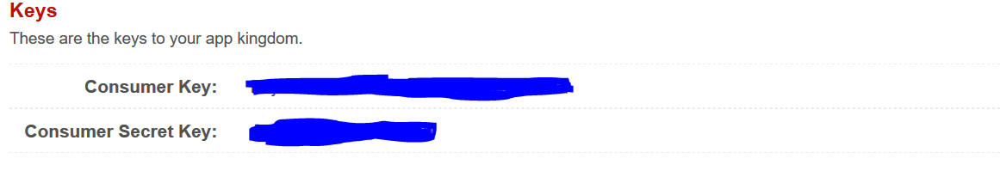

# What is Rops?

The European Patent Office (EPO) offers a web service that provides access to the EPO's raw data through the Open Patent Services (OPS) via a standardised XML interface and using the RESTful architecture. 

The data is from the same sources as the data in Espacenet and the European Patent Register and therefore it is a useful way to download worldwide patent data and analyze it directly in your IDE of choice. 

In the context of my master thesis, I developed an R package called Rops to access OPS using R, downloadable [here](https://github.com/AlessioNar/Rops)

The package is still in development and I am open to collaborations to improve its functionalities.

## Authentication process

Accessing the OPS API requires applying for an account to obtain the consumer key and the consumer secret key. You can register for an account at this [link](https://www.epo.org/searching-for-patents/data/web-services/ops.html)

The process usually takes a working day, since the OPS staff has to review your application and verify your personal information.

When your registration for the service is approved, you can access the developer's area, where you must create your first app by clicking on "My Apps."

By clicking on it, you can copy your credentials and store them in R as variables 



Then use the create_access_token function to retrieve an access token. Remember that the access token remain valid for 20 minutes only, so if you plan on making requests for a longer period of time you need to renew it. 

```{r create_access_token}
 consumer_key <-"your_consumer_key"
 consumer_secret_key <-"your_consumer_secret_key"
 
 access_token <- create_access_token(consumer_key, consumer_secret_key)
```
Remember that the access token remain valid for 20 minutes, after whose you need to access them again. 

## Basic functions in Rops

At present Rops presents four basic functions

- get_biblio: retrieves bibliographic data of patents in the form of dataframes given the epodoc/docdb id of the patent
- get_query: builds a query to search the EPO datasets based on various criteria. See documentation for more information
- get_claims: retrieves claims of a patent given the epodoc id
- get_description: retrieves description of a patent given the epodoc id


